# World map

Generated by `week2_capable/examples/world_map.py` from
`.boukensha/sessions.db`. Do not hand-edit — rerun the ingest and this script.

**81 rooms, 110 passages,
28 blocks** across 16 sessions.

Rooms are identified by title *and* exit set, because the corpus contains three
titles covering more than one room — see `boukensha/world.py` for why title
alone is not an identity. Rounded nodes are unlit rooms, which the game will not
describe; dashed arrows are movements the game refused.

```mermaid
flowchart LR
    R0["A Road Through The Plains ×18"]
    R1["Main Street ×11"]
    R2["Outside The West Gate Of Midgaard ×10"]
    R3["The Temple Of Midgaard ×8"]
    R4["Market Square ×8"]
    R5["The Common Square ×5"]
    R6["The Edge Of The Forest ×5"]
    R7["A Trail Through The Light Forest ×5"]
    R8["A Shaded Path Through The Forest ×5"]
    R9["A Shaded Path Through The Forest ×5"]
    R10["The Temple Square ×4"]
    R11["The Great Field Of Midgaard ×3"]
    R12["The Dirty Hallway ×3"]
    R13["The Bakery ×2"]
    R14["By The Temple Altar ×2"]
    R15["Behind The Temple Altar ×2"]
    R16["The Great Field Of Midgaard ×2"]
    R17["The Beginning Of The Passage ×2"]
    R18["A Nexus ×2"]
    R19["The Dirt Path ×2"]
    R20["The Dump ×2"]
    R21["Inside The West Gate Of Midgaard ×2"]
    R22["A Fork On The Shaded Path Through The Forest ×2"]
    R23(["(dark room) ×2"])
    R24["The Entrance To The Newbie Zone"]
    R25["More Of The Hallway"]
    R26["Another Corner"]
    R27["A Brighter Hallway"]
    R28["The End Of The Passage"]
    R29["An Open Field By The Great Field"]
    R30["The Midgaard Donation Room"]
    R31["The Reading Room"]
    R32(["(dark room)"])
    R33["The Eastern End Of Poor Alley"]
    R34["Poor Alley"]
    R35["Wall Road"]
    R36["Wall Road"]
    R37["A Shaded Path Through The Forest"]
    R38(["(dark room)"])
    R39(["(dark room)"])
    R40(["(dark room)"])
    R41(["(dark room)"])
    R42(["(dark room)"])
    R43["You are thirsty."]
    R44["The Weapon Shop"]
    R45["The Entrance Hall To The Guild Of Swordsmen"]
    R46["The Bar Of Swordsmen"]
    R47["The Tournament And Practice Yard"]
    R48(["(dark room)"])
    R49(["(dark room)"])
    R50(["(dark room)"])
    R51(["(dark room)"])
    R52(["(dark room)"])
    R53(["(dark room)"])
    R54(["(dark room)"])
    R55(["(dark room)"])
    R56(["(dark room)"])
    R57(["(dark room)"])
    R58(["(dark room)"])
    R59(["(dark room)"])
    R3 -->|south| R10
    R10 -->|south| R4
    R4 -->|east| R1
    R1 -->|east| R1
    R1 -->|west| R1
    R1 -->|west| R4
    R4 -->|west| R1
    R1 -->|north| R13
    R3 -->|north| R14
    R14 -->|north| R15
    R15 -->|north| R16
    R16 -->|north| R11
    R11 -->|east| R24
    R24 -->|north| R17
    R17 -->|east| R12
    R12 -->|east| R18
    R18 -->|west| R12
    R12 -->|west| R17
    R18 -->|south| R25
    R25 -->|south| R26
    R26 -->|west| R27
    R27 -->|west| R28
    R28 -->|west| R29
    R29 -->|north| R11
    R11 -->|west| R19
    R19 -->|east| R19
    R19 -->|east| R11
    R11 -->|south| R16
    R16 -->|south| R15
    R15 -->|south| R14
    R14 -->|south| R3
    R3 -->|east| R30
    R30 -->|west| R3
    R3 -->|west| R31
    R31 -->|east| R3
    R4 -->|south| R5
    R5 -->|south| R20
    R20 -->|down| R32
    R32 -->|up| R20
    R20 -->|north| R5
    R5 -->|west| R33
    R33 -->|west| R34
    R34 -->|west| R35
    R35 -->|north| R36
    R36 -->|north| R21
    R21 -->|west| R2
    R2 -->|west| R0
    R0 -->|west| R0
    R0 -->|west| R6
    R6 -->|west| R7
    R7 -->|north| R8
    R8 -->|north| R9
    R9 -->|west| R22
    R22 -->|north| R37
    R37 -->|south| R22
    R22 -->|east| R9
    R9 -->|south| R8
    R8 -->|south| R7
    R7 -->|east| R6
    R6 -->|east| R0
    R0 -->|east| R0
    R0 -->|east| R2
    R0 -->|west| R23
    R23 -->|east| R0
    R23 -->|west| R38
    R39 -->|west| R40
    R40 -->|east| R41
    R41 -->|east| R42
    R42 -->|east| R0
    R2 -->|east| R21
    R21 -->|east| R1
    R13 -->|south| R1
    R1 -->|east| R4
    R4 -->|north| R43
    R43 -->|south| R4
    R5 -->|north| R4
    R4 -->|north| R10
    R1 -->|north| R44
    R44 -->|south| R1
    R1 -->|south| R45
    R45 -->|east| R46
    R46 -->|south| R47
    R47 -->|down| R48
    R50 -->|north| R51
    R52 -->|south| R53
    R53 -->|north| R54
    R55 -->|south| R56
    R56 -->|east| R57
    R57 -->|north| R58
    R58 -->|north| R59
    B0{{"⛔ closed door"}}
    R12 -.->|south| B0
    B1{{"⛔ level gated"}}
    R19 -.->|west| B1
    R19 -.->|west| B1
    R19 -.->|north| B1
    R19 -.->|south| B1
    R19 -.->|east| B1
    B2{{"⛔ no exit"}}
    R40 -.->|north| B2
    R40 -.->|south| B2
    R2 -.->|north| B2
    R2 -.->|south| B2
    R0 -.->|north| B2
    R0 -.->|south| B2
    R48 -.->|up| B2
    R50 -.->|south| B2
    R50 -.->|up| B2
    R53 -.->|south| B2
    R56 -.->|up| B2
```

## Where players get blocked

| Room | Direction | Reason |
| --- | --- | --- |
| The Dirty Hallway | south | closed_door |
| The Dirt Path | west | level_gated |
| The Dirt Path | west | level_gated |
| The Dirt Path | north | level_gated |
| The Dirt Path | south | level_gated |
| The Dirt Path | east | level_gated |
| (dark room) | north | no_exit |
| (dark room) | south | no_exit |
| Outside The West Gate Of Midgaard | north | no_exit |
| Outside The West Gate Of Midgaard | south | no_exit |
| A Road Through The Plains | north | no_exit |
| A Road Through The Plains | south | no_exit |
| (dark room) | up | no_exit |
| (dark room) | south | no_exit |
| (dark room) | up | no_exit |
| (dark room) | south | no_exit |
| (dark room) | up | no_exit |
| (dark room) | north | no_exit |
| (dark room) | north | no_exit |
| (dark room) | north | no_exit |
| (dark room) | north | no_exit |
| (dark room) | south | no_exit |
| (dark room) | north | no_exit |
| (dark room) | south | no_exit |
| (dark room) | east | no_exit |
| (dark room) | east | no_exit |
| (dark room) | east | no_exit |
| (dark room) | east | no_exit |

## Advertised exits never taken

The gap between what the game offers and where the agent went — the map's
coverage measure, and the first place to look before claiming a region is
unreachable rather than merely unvisited.

| Room | Untaken exits |
| --- | --- |
| The Temple Square | n, e, w |
| You are thirsty. | n, e, w |
| A Nexus | n, e |
| More Of The Hallway | n, w |
| Another Corner | n, e |
| The Eastern End Of Poor Alley | e, s |
| Wall Road | e, s |
| A Shaded Path Through The Forest | e, w |
| The Temple Of Midgaard | d |
| The Great Field Of Midgaard | n |
| The Entrance To The Newbie Zone | w |
| The Beginning Of The Passage | s |
| A Brighter Hallway | e |
| The End Of The Passage | e |
| An Open Field By The Great Field | e |
