# World map

Generated by `week2_capable/examples/world_map.py` from
`.boukensha/sessions.db`. Do not hand-edit — rerun the ingest and this script.

**37 rooms, 62 passages,
6 blocks** across 7 sessions.

Rooms are identified by title *and* exit set, because the corpus contains three
titles covering more than one room — see `boukensha/world.py` for why title
alone is not an identity. Rounded nodes are unlit rooms, which the game will not
describe; dashed arrows are movements the game refused.

```mermaid
flowchart LR
    R0["The Temple Of Midgaard ×8"]
    R1["A Road Through The Plains ×6"]
    R2["Main Street ×4"]
    R3["Market Square ×3"]
    R4["The Great Field Of Midgaard ×3"]
    R5["The Dirty Hallway ×3"]
    R6["The Temple Square ×2"]
    R7["By The Temple Altar ×2"]
    R8["Behind The Temple Altar ×2"]
    R9["The Great Field Of Midgaard ×2"]
    R10["The Beginning Of The Passage ×2"]
    R11["A Nexus ×2"]
    R12["The Dirt Path ×2"]
    R13["The Common Square ×2"]
    R14["The Dump ×2"]
    R15["Outside The West Gate Of Midgaard ×2"]
    R16["The Edge Of The Forest ×2"]
    R17["A Trail Through The Light Forest ×2"]
    R18["A Shaded Path Through The Forest ×2"]
    R19["A Shaded Path Through The Forest ×2"]
    R20["A Fork On The Shaded Path Through The Forest ×2"]
    R21["The Bakery"]
    R22["The Entrance To The Newbie Zone"]
    R23["More Of The Hallway"]
    R24["Another Corner"]
    R25["A Brighter Hallway"]
    R26["The End Of The Passage"]
    R27["An Open Field By The Great Field"]
    R28["The Midgaard Donation Room"]
    R29["The Reading Room"]
    R30(["(dark room)"])
    R31["The Eastern End Of Poor Alley"]
    R32["Poor Alley"]
    R33["Wall Road"]
    R34["Wall Road"]
    R35["Inside The West Gate Of Midgaard"]
    R36["A Shaded Path Through The Forest"]
    R0 -->|south| R6
    R6 -->|south| R3
    R3 -->|east| R2
    R2 -->|east| R2
    R2 -->|west| R2
    R2 -->|west| R3
    R3 -->|west| R2
    R2 -->|north| R21
    R0 -->|north| R7
    R7 -->|north| R8
    R8 -->|north| R9
    R9 -->|north| R4
    R4 -->|east| R22
    R22 -->|north| R10
    R10 -->|east| R5
    R5 -->|east| R11
    R11 -->|west| R5
    R5 -->|west| R10
    R11 -->|south| R23
    R23 -->|south| R24
    R24 -->|west| R25
    R25 -->|west| R26
    R26 -->|west| R27
    R27 -->|north| R4
    R4 -->|west| R12
    R12 -->|east| R12
    R12 -->|east| R4
    R4 -->|south| R9
    R9 -->|south| R8
    R8 -->|south| R7
    R7 -->|south| R0
    R0 -->|east| R28
    R28 -->|west| R0
    R0 -->|west| R29
    R29 -->|east| R0
    R3 -->|south| R13
    R13 -->|south| R14
    R14 -->|down| R30
    R30 -->|up| R14
    R14 -->|north| R13
    R13 -->|west| R31
    R31 -->|west| R32
    R32 -->|west| R33
    R33 -->|north| R34
    R34 -->|north| R35
    R35 -->|west| R15
    R15 -->|west| R1
    R1 -->|west| R1
    R1 -->|west| R16
    R16 -->|west| R17
    R17 -->|north| R18
    R18 -->|north| R19
    R19 -->|west| R20
    R20 -->|north| R36
    R36 -->|south| R20
    R20 -->|east| R19
    R19 -->|south| R18
    R18 -->|south| R17
    R17 -->|east| R16
    R16 -->|east| R1
    R1 -->|east| R1
    R1 -->|east| R15
    B0{{"⛔ closed door"}}
    R5 -.->|south| B0
    B1{{"⛔ level gated"}}
    R12 -.->|west| B1
    R12 -.->|west| B1
    R12 -.->|north| B1
    R12 -.->|south| B1
    R12 -.->|east| B1
```

## Where players get blocked

| Room | Direction | Reason |
| --- | --- | --- |
| The Dirty Hallway | south | closed_door |
| The Dirt Path | west | level_gated |
| The Dirt Path | west | level_gated |
| The Dirt Path | north | level_gated |
| The Dirt Path | south | level_gated |
| The Dirt Path | east | level_gated |

## Advertised exits never taken

The gap between what the game offers and where the agent went — the map's
coverage measure, and the first place to look before claiming a region is
unreachable rather than merely unvisited.

| Room | Untaken exits |
| --- | --- |
| The Temple Square | n, e, w |
| A Nexus | n, e |
| More Of The Hallway | n, w |
| Another Corner | n, e |
| The Common Square | n, e |
| The Eastern End Of Poor Alley | e, s |
| Wall Road | e, s |
| Inside The West Gate Of Midgaard | e, s |
| A Shaded Path Through The Forest | e, w |
| The Temple Of Midgaard | d |
| Market Square | n |
| Main Street | s |
| The Bakery | s |
| The Great Field Of Midgaard | n |
| The Entrance To The Newbie Zone | w |
