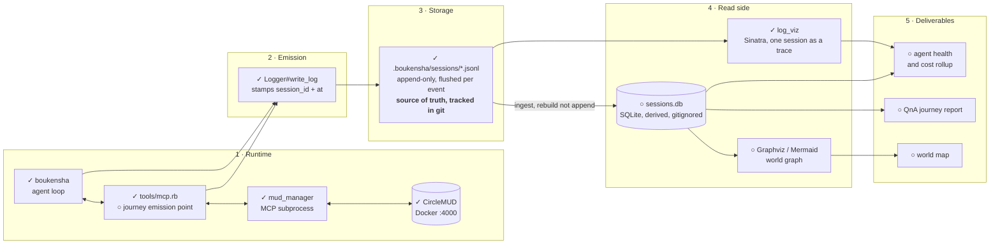
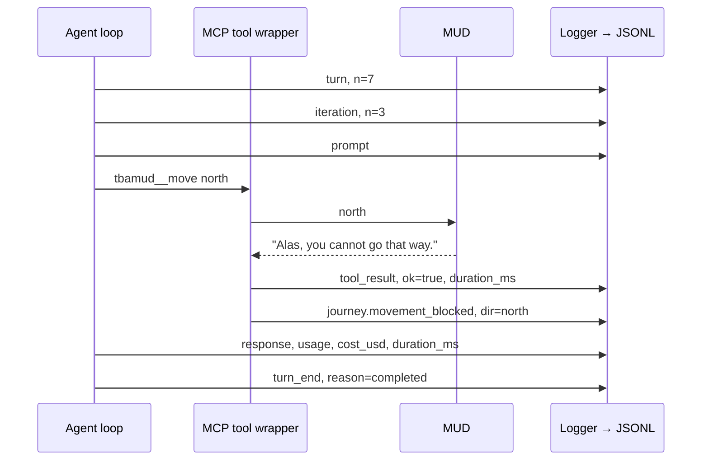
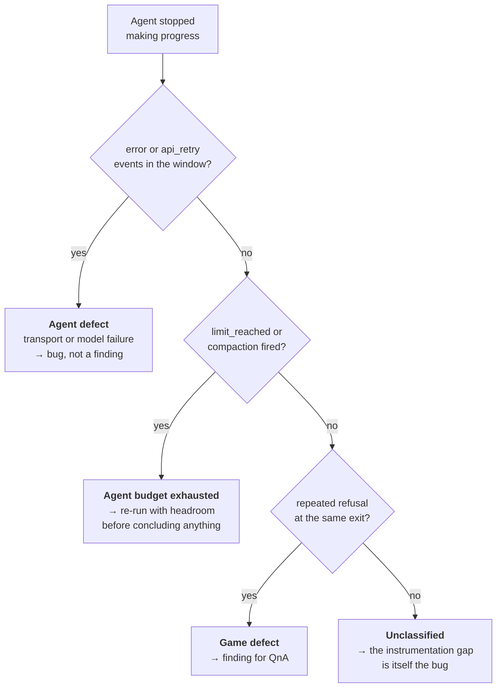

# Observability Architecture

Companion to [`obs_plan.md`](obs_plan.md) and [`layer1`](layer1). Those two say
*what* to build and in what order; this one shows *how the pieces sit together*
and why the shape is what it is.

Legend used throughout: **✓** already exists, **○** to be built this week.

---

## 1. The spine

Everything is one linear flow — emit, store, read, deliver — with exactly one
source of truth in the middle.

**The one-way arrow into storage is the point.** Nothing reads the JSONL and
writes back to it. Every reader — `log_viz`, the SQLite ingest, the graph
builder — is downstream and disposable: delete `sessions.db` and the whole read
side rebuilds from files that are still in git. That is what makes it safe to
change the aggregation schema mid-week without risking the evidence.

Note also that the JSONL is **tracked** (62 files committed) while the DB is
**ignored**. The recorded sessions are research data; the database is a cache
over them. See `.gitignore:20–22`.

---

## 2. Two streams, one correlation key

Layer 1 and Layer 2 are not separate pipelines. They interleave in the same file,
distinguished by `phase` and bound together by `session_id` + `turn` +
`iteration`.

Here is a single blocked move, as it lands on disk:

Two things to read off that sequence:

**The tool call succeeded.** `ok=true` is correct here — the MUD answered, the
transport worked, nothing failed. The *player* was blocked, and that is a
`journey.movement_blocked` event, not a tool error. Keeping those distinct is
the entire reason [`layer1`](layer1) §1.1 insists on a real result type rather
than sniffing text: once "the tool failed" and "the game said no" are the same
signal, no finding can be trusted.

**Neither `tool_result` nor `journey.movement_blocked` carries `turn` or
`iteration` on the wire.** Only the `turn` and `iteration` events do. The
position of every other event is implied by the ones before it, which is why the
SQLite ingest forward-fills those two columns once
([`layer1`](layer1) §2.1) instead of leaving every reader to re-derive them —
`log_viz` already does exactly that re-derivation at
`log_viz/lib/log_viz/session.rb:71–76`.

---

## 3. What the architecture is *for*: attribution

The structural reason both streams share a file is that most useful questions
need both to answer. "The agent stopped exploring" is not yet a finding — it is
an observation with at least four explanations, and the telemetry has to pick
between them.

Every branch of that tree depends on a Layer 1 item that does not exist yet:

| Branch | Needs | Status today |
| --- | --- | --- |
| transport or model failure | `error`, `api_retry` phases | ○ [`layer1`](layer1) §1.3 |
| budget exhausted | `limit_reached`, `compaction` | ✓ implemented, **never once fired** — §1.6 |
| ran out of session | `session_end` with a reason | ○ §1.2 — 0 of 62 files have it |
| game defect | journey events | ○ Layer 2 |

That table is the argument for the ordering in `obs_plan.md` §7. Layer 2 built
first would produce journey findings with no way to rule out the agent as their
cause — confident claims resting on nothing.

---

## 4. Why there is no collector in any of these diagrams

The conventional shape would put an OpenTelemetry SDK at the emission point, a
collector process beside it, and a tracing backend behind that. `obs_plan.md`
§5.1 records why not; architecturally the consequence is that **the boundary
between emission and storage is a filesystem write, not a network hop**.

That buys three properties this project specifically wants:

- **A failed write is loud.** An append to an open file either works or raises.
  A dropped OTLP export is silent, and week 1 was largely a catalogue of silent
  signal failures — a stdio server indistinguishable from a hang, an env var
  ignored without complaint.
- **The evidence outlives the run.** The 62 sessions on disk predate every tool
  in §4 of the first diagram and are still fully queryable by tools not yet
  written. Retention is `git`.
- **The read side is replaceable.** `log_viz`, SQLite and the graph builder are
  three independent readers of one format. Adding a fourth — including an OTLP
  exporter, if a distributed trace ever becomes real — is additive and touches
  no emission code.

The cost of the choice is equally concrete and worth stating: no live view, no
alerting, no cross-host aggregation, and no index until the ingest runs. For an
agent that runs in bounded sessions on one machine and produces a written report
at the end, none of those are load-bearing.

---

## 5. Where each plan lives on the diagram

| Region of diagram 1 | Plan |
| --- | --- |
| 2 · Emission, agent events | [`layer1`](layer1) §1 — six defects |
| 3 · Storage, file size | [`layer1`](layer1) §1.5 — prompt bloat, 85% of the largest file |
| 4 · `sessions.db` | [`layer1`](layer1) §2.1 — SQLite schema and ingest rules |
| 2 · Emission, journey events | `obs_plan.md` §3 Layer 2 — blocked on decision §4.1 |
| 4 · world graph | `obs_plan.md` §3 Layer 3 — blocked on decision §4.2, room identity |
| 5 · Deliverables | `obs_plan.md` §7 — verification gates |
